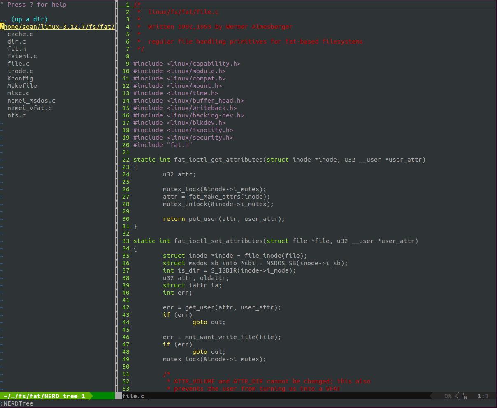

#Summary
Please understand that:
In order to use powerline, we need to install pathogen firstly. 
Then base on pathogen, we continue to install powerline(just mv powerline to bundle directory)

#Files
├── CONSOLAB-Powerline.ttf 
├── CONSOLAI-Powerline.ttf 
├── CONSOLA-Powerline.ttf 
├── CONSOLAZ-Powerline.ttf 
    above ttf file is font ttf, can be used by linux or windows system. If used by windows, just move to C\windows\fonts\.  
├── consolas-powerline-vim 
│   └── README.md 

├── fonts.dir 
├── fonts.scale 
├── installNerdTree.sh 
    this is used to install NerdTree plugin  
├── install.sh 
    this is to install pathogen plugin 
├── powerline.sh 
    this is to install powerline plugin 
├── README 
    instruction about this project 
└── repare.sh 
    this is used to Repair the Garbled font 
#Install Steps 
    So the install step is shown below:

    ./install.sh 
    ./powerline.sh 
    ./repare.sh 
    ./installNerdTree.sh 
    cat ./.vimrc > ~/.vimrc 

#Preview

